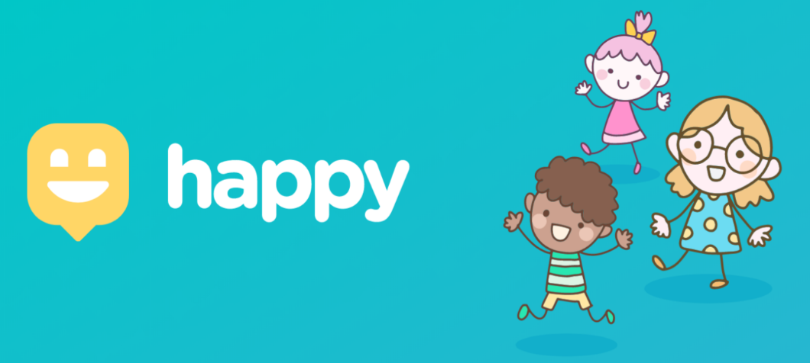

<div align="center">
    <h1>Happy</h1>
    <div id="logo-content">
        
    </div>

</br>

Plataforma de localização de orfanatos na NWL#03 (Next Level Week) pela [Rocketseat](https://rocketseat.com.br)

</div>

<div>

</br>

<h2>Ferramentas:</h2>
<p>As ferramentas que foram utilizadas na construção do projeto:</p>

* [Node.js](https://nodejs.org/en/)
* [npm](https://www.npmjs.com/get-npm) ou [Yarn](https://classic.yarnpkg.com/lang/en/)
* [Expo](https://expo.io)
* [React](https://reactjs.org)
* [React Native](https://reactnative.dev)
* [TypeScript](https://www.typescriptlang.org)

</br>

<h2>Layout:</h2>

Figma: [Web](https://www.figma.com/file/xL2SiFEW8pQ98BHqKZYay0/Happy-Web-(Copy)?node-id=0%3A1) 

Figma: [Mobile](https://www.figma.com/file/P0x8qoK9rsPpZzB0726nY0/Happy-Mobile-(Copy)?node-id=0%3A1)

</br>

<h2>Web:</h2>

```bash
# Clone este repositório
$ git clone https://github.com/MatheusSESH/happy

# Entre na pasta web
$ cd web

# Instale as dependências
$ yarn install

# Execute a aplicação
$ yarn start
```

<h2>Licença</h2>

<p>Esse projeto está sob a licença MIT. Veja o arquivo <a href="https://github.com/MatheusSESH/happy/blob/master/license">LICENSE</a> para mais detalhes.</p>
</div>

